<div align="center">



<br/>

<a href="https://mashood-liart.vercel.app/">
  
</a>
&nbsp;
<a href="https://www.linkedin.com/in/mahammad-mashood">
  
</a>
&nbsp;
<a href="https://github.com/mashood17">
  
</a>
&nbsp;
<a href="https://www.instagram.com/mashooood_">
  
</a>

<br/><br/>


</div>

---

<table>
<tr>
<td width="66%" valign="top">

## `01` — WHO I AM

I'm **Mahammad Mashood**, a Software Engineer from Mangaluru, India.

I build **full-stack web applications, real-time systems, backend APIs, and AI-powered products** with a focus on clean UX, reliable architecture, measurable performance, and shipping things that actually work.

I like working where **product thinking meets engineering** — turning an idea into an interface, an API, a database, a tested system, and finally a deployed product.

<br/>

**Currently focused on**

`Full-Stack` · `Backend Engineering` · `AI / LLMs` · `Real-Time Systems` · `System Design`

</td>
<td width="34%" valign="top" align="center">


<br/><br/>

🟢 **AVAILABLE FOR OPPORTUNITIES**

<br/>

`Mangaluru, India · IST`

</td>
</tr>
</table>

---

## `02` — WHAT I BUILD

<table>
<tr>
<td width="25%" align="center">

### ⚡
**PRODUCTS**

Full-stack applications with polished interfaces and real backend logic.

</td>
<td width="25%" align="center">

### 🤖
**AI**

Practical LLM integrations and AI-powered workflows.

</td>
<td width="25%" align="center">

### 🔄
**REAL-TIME**

WebSockets, live communication and responsive systems.

</td>
<td width="25%" align="center">

### 🧪
**ENGINEERING**

APIs, authentication, testing, performance and deployment.

</td>
</tr>
</table>

---

## `03` — SELECTED WORK

### ELATŌ
**Premium hospitality · digital experience · admin platform**

A modern digital platform bringing together **café, stay, events and digital-menu experiences**, with an administrative layer for managing content and menu data.

`React` `Python` `Supabase` `Responsive UI` `Admin Dashboard`

**[↗ View portfolio](https://mashood-liart.vercel.app/)**

---

### CampusLoop
**Real-time campus platform**

A full-stack platform built around real-time communication, authentication and backend workflows.

`React` `Flask` `PostgreSQL` `WebSockets` `JWT`

**Engineering proof**
- `72ms` average response time in reported load testing
- `50` concurrent users tested
- `0%` reported failure rate
- `21` automated tests · `100%` pass rate

---

### AI Timesheet Processor
**Document processing · automation · backend engineering**

A web application designed to extract data from handwritten monthly timesheets and populate a master Excel workflow using an employee identifier.

`Python` `FastAPI` `AI/OCR workflow` `Excel automation`

**[↗ Repository](https://github.com/mashood17/ai-timesheet-processor)**

---

### Student AI Hub
**AI tools for students**

A platform bringing multiple AI capabilities into a focused student-oriented experience.

`React` `Python` `LLM APIs` `AI integration`

---

## `04` — ENGINEERING STACK

<table>
<tr>
<td valign="top" width="33%">

**LANGUAGES**

`Python`  
`JavaScript (ES6+)`  
`SQL`  
`HTML5`  
`CSS3`

</td>
<td valign="top" width="33%">

**FRONTEND**

`React`  
`Tailwind CSS`  
`Vite`  
`Responsive Design`  
`Framer Motion`

</td>
<td valign="top" width="33%">

**BACKEND**

`Flask`  
`FastAPI`  
`Node.js`  
`Express.js`  
`REST APIs`  
`WebSockets`

</td>
</tr>

<tr>
<td valign="top">

**DATA**

`PostgreSQL`  
`MongoDB`  
`MySQL`  
`Supabase`

</td>
<td valign="top">

**SECURITY**

`JWT`  
`Access / Refresh Tokens`  
`Token Rotation`  
`Authentication`

</td>
<td valign="top">

**ENGINEERING**

`Pytest`  
`Locust`  
`Docker`  
`Git`  
`Postman`  
`Vercel` · `Render`

</td>
</tr>
</table>

---

## `05` — GITHUB / LIVE SIGNALS

<div align="center">


<br/>


</div>

<br/>

<div align="center">

**Contribution activity**


</div>

> The contribution animation is generated by GitHub Actions and refreshed automatically on pushes to `main` and on a daily schedule.

---

## `06` — PROOF OF WORK

<div align="center">

**72ms**  
<sub>avg. response</sub>

&nbsp;&nbsp;&nbsp;&nbsp;

**50**  
<sub>users load-tested</sub>

&nbsp;&nbsp;&nbsp;&nbsp;

**0%**  
<sub>reported failures</sub>

&nbsp;&nbsp;&nbsp;&nbsp;

**21**  
<sub>automated tests</sub>

&nbsp;&nbsp;&nbsp;&nbsp;

**100%**  
<sub>test pass rate</sub>

&nbsp;&nbsp;&nbsp;&nbsp;

**MULTI-LLM**  
<sub>AI integrations</sub>

</div>

---

## `07` — RESEARCH

### *Job Portal Website*

**Journal of Emerging Technologies and Innovative Research (JETIR)**  
Volume 12 · Issue 7 · July 2025

Research covering the design and implementation of a job portal web application.

---

## `08` — NOW

```text
01  BUILDING   → modern full-stack products
02  EXPLORING  → AI / LLM application patterns
03  ENGINEERING→ APIs, real-time systems & backend architecture
04  IMPROVING  → testing, performance & system design
05  LOOKING    → Software Engineering opportunities
```

---

<div align="center">

### LET'S BUILD SOMETHING USEFUL.

<a href="https://mashood-liart.vercel.app/">Portfolio</a>
&nbsp; · &nbsp;
<a href="https://www.linkedin.com/in/mahammad-mashood">LinkedIn</a>
&nbsp; · &nbsp;
<a href="mailto:mashoodrenja17@gmail.com">Email</a>

<br/><br/>


<br/><br/>

<sub>Build quietly. Ship consistently. Keep improving.</sub>

</div>
